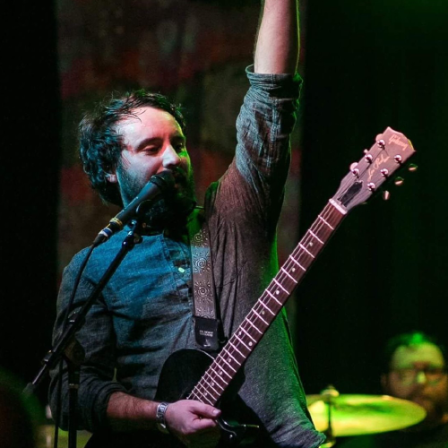

<!-- Main -->

<!-- One -->
<section id="one">
	

		<header class="major">
			<h1>Current Members</h1>
		</header>
		
    

			

				

				

				

					
				

				

					 
					 
					<a href="#">Dr. Leanne Hirshfield</a>
					 
					<a href="#" class="icon fa-briefcase"> CINC, 182G</a>
					 
					<a href="#" class="icon fa-phone"> (303)-735-3027</a>
					 
					<a href="https://scholar.google.com/citations?hl=en&user=5H_nV8cAAAAJ" class="icon fa-book"> Google Scholar</a>
					 
					<a href="#" class="icon fa-envelope">  leanne.hirshfield@colorado.edu</a>
				

			

    

    
<h3>PhD Students</h3>

    <!-- Break -->
    

			

				

				

				

					
				

				

				

				

					
				

			

			

				

				

				

					<a href="#">Trevor Grant</a>
					 
					<a href="#" class="icon fa-briefcase"> Computer Science</a>
					 
					<a href="#" class="icon fa-envelope">  trevor.grant@colorado.edu</a>
				

				

				

				

					<a href="#">Lucas Hayne</a>
					 
					<a href="#" class="icon fa-briefcase"> Computer Science</a>
					 
					<a href="#" class="icon fa-envelope">  lucas.haynes@colorado.edu</a>
				

			

    

		

			

				

				

				

					
				

			

			

				

				

				

					<a href="#">Lucca Eloy</a>
					 
					<a href="#" class="icon fa-briefcase"> Computer Science</a>
					 
					<a href="#" class="icon fa-envelope">  lucca.eloy@colorado.edu</a>
				

			

    

    
<h3>Graduate Students</h3>

    

			

				

				

				

					
				

				

				

			

			

				

				

				

					<a href="#">Kaunil N. Dhruv</a>
					 
					<a href="#" class="icon fa-briefcase"> Computer Science</a>
					 
					<a href="http://kaunild.github.io" class="icon fa-home">  http://kaunild.github.io</a>
					 
					<a href="http://github.com/kaunild" class="icon fa-github">  kaunild</a>
					 
					<a href="#" class="icon fa-envelope">  kaunil.dhruv@colorado.edu</a>

				

			

    

  

</section>

